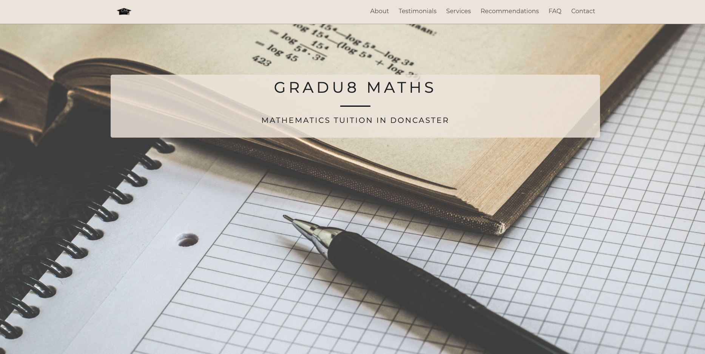

# Gradu8 Maths

> Website for a maths tutor

## Table of contents

- [General info](#general-info)
- [Screenshots](#screenshots)
- [Technologies](#technologies)
- [Features](#features)
- [Status](#status)
- [Contact](#contact)

## General info

A website for a maths tutor. Visitors to the site can see relevant information, write reviews and contact the tutor.

## Screenshot

## Technologies

- HTML
- CSS
- Javascript

## Features

Features ready:

- See information related to the tutor.
- Write reviews by being linked to Facebook.
- Send an email to the tutor by filling in a form and being taken to your email provider of choice.

## Status

Project is unfinished.

## Contact

Created by [@joshuakent](josh.kent94@yahoo.co.uk) - feel free to contact me!
